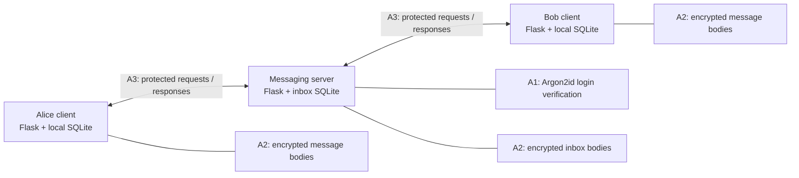

# Python Security Engineering Coursework

**Password authentication, encrypted message storage, and an authenticated client-server channel.**

This repository contains my SEC-206 coursework, including implementations of assignments A1, A2 and A3 in a Python messaging application. The project demonstrates how cryptographic library APIs integrate with authentication, SQLite persistence and request/response flows.

**Author:** [Thanapol Wongtharua](https://github.com/trunkooze)  
**Technologies:** Python · Flask · SQLite · Argon2id · ChaCha20-Poly1305 · AES-GCM · P-256 ECDH/ECDSA · HKDF-SHA256

## My contribution

I implemented the A1–A3 requirements on top of a provided teaching scaffold. The scaffold supplied the Flask applications, user interface, database infrastructure and runtime channel integration. My work focused on replacing the cryptographic placeholders and connecting authentication and storage protection at the required call sites.

| Assignment | Implementation | Start reading here |
| --- | --- | --- |
| **A1 — Password authentication** | Argon2id password hashing and verification; integrated hashing into user seeding and verification into login. | [Password functions](assignments/shared/passwords.py), [authentication service](assignments/server_app/auth.py) |
| **A2 — Message encryption at rest** | Password-derived 256-bit storage keys using Argon2id; ChaCha20-Poly1305 encryption; authenticated row context at both client and server storage boundaries. | [Storage cipher](assignments/shared/storage_crypto.py), [client integration](assignments/client_app/core.py), [server integration](assignments/server_app/message_service.py) |
| **A3 — Client-server channel** | Ephemeral P-256 key agreement, server signature verification using a pinned public key, directional keys derived with HKDF-SHA256, and AES-GCM record protection. | [Handshake and record encryption](assignments/shared/channel_crypto.py) |

The original briefs are preserved: [A1](assignments/A1_INSTRUCTION.md), [A2](assignments/A2_INSTRUCTION.md), [A3](assignments/A3_INSTRUCTION.md). The [scaffold README](assignments/README.md) describes the original baseline and assignment instructions, rather than the current completion status.

## How it works



1. A client establishes a channel and verifies the server's signed handshake.
2. Login credentials travel inside an encrypted channel record; the server verifies the password hash and issues a bearer token.
3. The client unlocks its local storage using a separate database password.
4. Messages travel through the server using protected records and are encrypted before their bodies are stored in SQLite.
5. The recipient pulls messages and stores its own encrypted local history.

This is **client-to-server protection, not end-to-end encryption between users**: the server handles message plaintext while relaying it.

### Implementation details

- **Storage context:** client ciphertext is bound to the table, message direction, peer and message ID. Server ciphertext is bound to the inbox table, sender, recipient and message ID. Decryption reconstructs this context instead of trusting the envelope's debug copy of the AAD.
- **Channel context:** records authenticate the session ID, direction, sequence counter and request path alongside the encrypted payload.
- **Key separation:** the channel derives different keys for client-to-server and server-to-client traffic. Storage encryption uses separately password-derived keys.
- **Code organization:** handshake state, channel records and storage encryption are represented by separate Python classes and dataclasses.

## Run locally

Requires **Python 3.11+** and [uv](https://docs.astral.sh/uv/).

```bash
git clone https://github.com/trunkooze/Lab_SEC_206_thanapol.git
cd Lab_SEC_206_thanapol/assignments
uv sync --locked --dev
uv run python scripts/run_all.py
```

| Service | Local URL | Demo login | Local database password |
| --- | --- | --- | --- |
| Alice | http://127.0.0.1:5001 | `alice` / `alicepass` | `alicedbpass` |
| Bob | http://127.0.0.1:5002 | `bob` / `bobpass` | `bobdbpass` |
| Server debug | http://127.0.0.1:5000/debug | — | — |

Log in, unlock local storage, send a message, then open the other client and retrieve it. The debug views expose stored envelopes and channel state for learning. Press **Ctrl+C** in the launch terminal to stop the processes.

To start again with fresh local state, stop the application first. The following command **deletes local demo databases and logs**:

```bash
uv run python scripts/reset_state.py
```

## Validation status

Run the existing suite from `assignments/`:

```bash
uv run pytest -q
```

At source commit `23504756f41353a33b36f21ac0c1e3d1a9ac8a24`, a local run on **7 October 2026** reported **6 passed, 7 failed**. The failing tests retain expectations from the insecure scaffold:

- Five channel tests supply empty ephemeral public keys; the implementation rejects them.
- Two scaffold-contract tests expect placeholder hashing or plaintext authentication code.

These tests need migration to the completed assignment behavior. This repository does **not** claim a green test suite or a security audit.

Separate local smoke checks passed for password hashing and wrong-password rejection; storage encryption/decryption and rejection of altered ciphertext or row context; matching channel session keys; and record rejection for incorrect counters or routes. These limited checks do not replace a maintained regression suite or adversarial review.

## Scope and limitations

This is an educational implementation, not a production messaging service. It retains fixed demo accounts, checked-in development signing keys, debug views, and simplified session/key handling from the scaffold. The client uses Flask session state for derived key material. Run locally with disposable data; the development keys are not deployment credentials.

Production hardening would require a standard transport such as TLS, reviewed handshake freshness and transcript binding, appropriate server-side secret storage, authentication rate limiting, key lifecycle management, and tests for malformed input and attack cases. The custom channel is an exercise in cryptographic integration, not a replacement for TLS.

## Repository map

```text
assignments/
  A1_INSTRUCTION.md       Original password-authentication brief
  A2_INSTRUCTION.md       Original storage-encryption brief
  A3_INSTRUCTION.md       Original secure-channel brief
  shared/                Password, storage and channel cryptography
  client_app/            Client application and local message storage
  server_app/            Authentication, message relay and inbox storage
  scripts/               Local launch and reset commands
  tests/                 Provided tests, including baseline-only assertions
lab-1/ ... lab-5/         Other security coursework exercises
```
