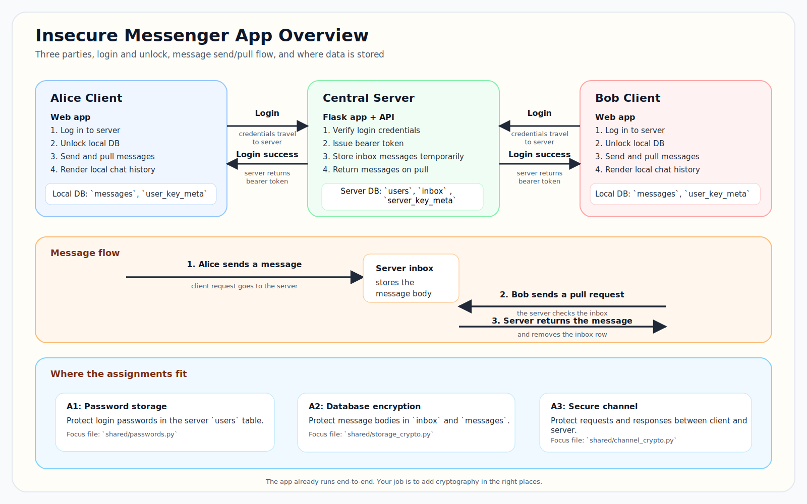

# Insecure Messenger Scaffolding

This repository is the starting point for your assignments.

The application is intentionally insecure at baseline, but it already runs end-to-end so you can focus on adding cryptography in the right places instead of building the whole app from scratch.



## What This App Does
There are three running parties:
1. a central server
2. Alice's client
3. Bob's client

The clients are simple Flask web apps. Each client can log in, unlock its local database, send messages, receive messages, and inspect debug pages.

At a high level, this is how the app works:
1. a client logs in to the server and receives a bearer token
2. the client unlocks its local database and derives a local storage key from the unlock password
3. when the client sends a message, the request goes to the server and the server stores that message temporarily in its `inbox` table
4. the server protects the stored inbox body with its own database-encryption layer
5. the recipient pulls messages from the server
6. the server returns the message and removes it from `inbox`
7. each client stores its own local message history in its own SQLite database
8. the client protects and later decrypts those local stored message bodies when rendering chat

## What You Will Change
For these assignments, you should treat the application flow and web UI as scaffolding.

The assignments are centered around the shared crypto modules, but not all of them are single-file changes:
1. A1 uses `shared/passwords.py` and `server_app/auth.py`
2. A2 uses `shared/storage_crypto.py`, `client_app/core.py`, and `server_app/message_service.py`
3. A3 uses `shared/channel_crypto.py`

Start with the matching assignment instruction, then inspect the call sites it points you to.

You should not need to redesign the application or change the frontend.

## Assignment Guide
Start with these documents:
1. `A1_INSTRUCTION.md`
2. `A2_INSTRUCTION.md`
3. `A3_INSTRUCTION.md`

## Setup
```bash
uv venv .venv
uv sync --dev
```

## Run
You can start everything in one command:

```bash
uv run python scripts/run_all.py
```

Or run each process separately.

Server:
```bash
export SERVER_DB_PASSWORD=server-db-password
uv run python scripts/run_server.py
```

Alice:
```bash
uv run python scripts/run_client_alice.py
```

Bob:
```bash
uv run python scripts/run_client_bob.py
```

`run_all.py` writes separate logs to a timestamped folder:
1. `logs/<timestamp>/server.log`
2. `logs/<timestamp>/alice.log`
3. `logs/<timestamp>/bob.log`

## Reset state
To delete the server/client SQLite databases and logs:

```bash
uv run python scripts/reset_state.py
```

This is especially useful after changing assignment logic.

## Where to open the app
1. Alice client: `http://127.0.0.1:5001`
2. Bob client: `http://127.0.0.1:5002`
3. Server debug page: `http://127.0.0.1:5000/debug`

## Login and unlock
Fixed credentials:
1. `alice / alicepass`
2. `bob / bobpass`

After login, each client goes to `/unlock`. The local DB password is intentionally different from the login password.

That unlock step is part of A2 and is where the client derives the key used to protect its local message history.

Default local DB passwords:
1. Alice: `alicedbpass`
2. Bob: `bobdbpass`

## How to use the debug pages
The debug pages are there to help you understand what is actually being stored and sent.

Client debug page:
1. shows raw local database rows
2. shows raw network log entries
3. does not decrypt stored values for you

Server debug page:
1. shows `users`
2. shows `inbox`
3. shows `server_key_meta`
4. shows `channel_sessions`

Use these pages to compare the insecure baseline with your secure implementation.

## Files To Focus On
Start here:
1. `shared/passwords.py`
2. `shared/storage_crypto.py`
3. `shared/channel_crypto.py`
4. the matching assignment instruction document
